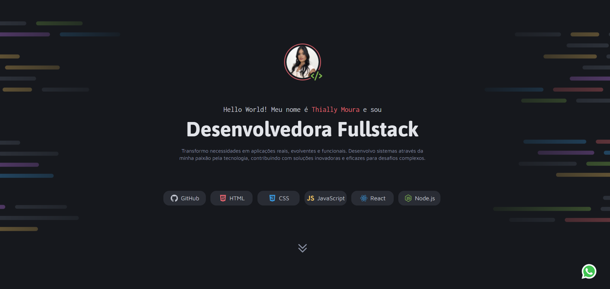

<h1> 🚀 Desafio prático - Portfolio</h1>

  

 

## 🚀 Tecnologias

Esse projeto foi desenvolvido com as seguintes tecnologias:

- HTML e CSS
- Git e Github
- Figma

## 💻 Projeto

Página web com informações dos meus projetos, serviços e contatos.
Este projeto foi realizado como um desafio prático no curso de Fullstack da Rocketseat, onde fui responsável por todo o desenvolvimento, aplicando os conhecimentos adquiridos ao longo das aulas.
